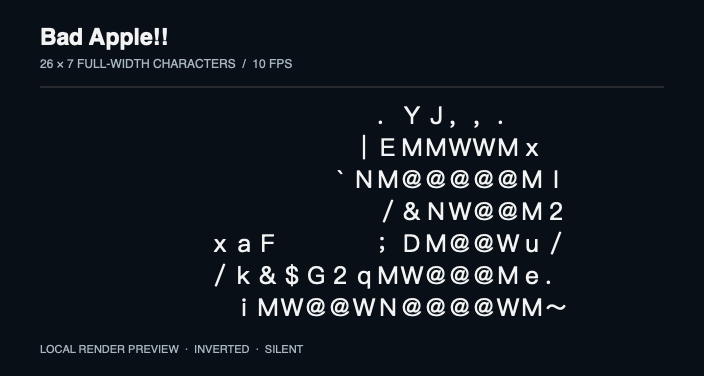

# OpenRayneo

[English](README.md) · [简体中文](README.zh-CN.md)

**Send notifications, scripts, live text, and todos to RayNeo iO glasses from your Mac.**

OpenRayneo is an unofficial, experimental Mac app and Bluetooth bridge with a local HTTP API. Use the desktop control panel, shell scripts, or local automation. The bridge connects directly to the glasses; it does not require a phone relay, cloud service, or a modified official app.

It uses the glasses' existing notification, teleprompter, caption, prompt, and todo interfaces. Arbitrary graphics, screen mirroring, and custom display layouts are outside the current scope.

## ASCII-style character video

Turn a local video into a tiny text animation on the glasses. In **字符视频**, choose a movie, select **全角灰度 26×7** (full-width grayscale), **方块** (blocks), or experimental half blocks, then play at **5 or 10 updates/s**. Playback is silent; inversion and contrast enhancement are optional. The app decodes video locally and replaces the complete caption frame, skipping late frames to avoid catch-up playback.



*Bad Apple!! — an 8-second local render preview at 10 fps, using the app's decoder and full-width brightness mapping with inversion enabled. This is a software preview, not footage through the glasses. The source PV artwork belongs to its respective creators.*

Each character represents the average brightness of a small image region. “ASCII-style” describes the appearance: the current grayscale mode uses **full-width Unicode characters and ideographic spaces** because the earlier half-width ASCII modes misaligned on the glasses. The wearer has confirmed that full-width grayscale displays and aligns correctly on the tested glasses. Use **检查字符对齐** when checking another device or firmware. The current renderer fills the grid and can distort the source aspect ratio. No video is bundled with the app.

See [the character-video guide](docs/text-video.md) for rendering details and tested limits.

## Agent skill

The repository includes a distributable [OpenRayneo API skill](.agents/skills/openrayneo-api/SKILL.md) with connection guidance, endpoint examples, session rules, and a local request helper. It lets a local agent operate an existing Bridge; installing the skill does not install or pair the glasses.

Agents that discover `.agents/skills/` can use it from this checkout. For use outside the repository, copy the complete `.agents/skills/openrayneo-api/` directory into your agent's skill directory (for Codex, `${CODEX_HOME:-$HOME/.codex}/skills/`). Other agents can read `SKILL.md` directly. Keep its `references/` and `scripts/` alongside it.

Configure the running Bridge's current `OPENRAYNEO_API_URL` and `OPENRAYNEO_API_TOKEN` locally, then ask: **“Use $openrayneo-api to check the glasses connection and display my text.”** Never publish your token. The helper requires `uv` and uses only the Python standard library; it does not retry device writes automatically.

## What works

Verified on one RayNeo iO with an Apple Silicon Mac running macOS 15.6.1:

| Capability | Result |
| --- | --- |
| Direct Bluetooth connection | BLE authentication and RFCOMM channel 26 connected |
| Custom notifications | Chinese title and body visibly confirmed |
| Chinese teleprompter text | Short script and 120-line, 16,319-byte script displayed |
| Playback controls | Pause, resume, and stop visibly confirmed |
| Real-time captions | Two-line Chinese text displayed and replaced without noticeable loading |
| Text-grid display | 26×7 full-width character grid with blank-cell padding; 5–10 updates/s selected for daily use |
| Real-time prompts | Chinese question and answer displayed; updates replaced the previous pair |
| Todos | New item visibly confirmed alongside an existing item; test removal confirmed by readback |
| Weather cards | Custom labels, negative temperatures, description, range, night icon, and ordered hourly entries visibly confirmed |
| Glasses microphone ASR | Chinese speech recognized on the Mac and visibly updated in the glasses' prompt-page body |
| Local WAV recording | Continuous stereo recording finalized and played back; two different channel signals confirmed |
| Microphone channel mapping | Owner's experiment: channel 1 bone-conduction/wearer, channel 2 forward-facing/other speakers |
| LifeLog wake diagnostics | Direct Mac enable/wake/audio flow; wearer and external speech triggered wake in controlled trials |
| Larger writes | Segmented to the negotiated RFCOMM MTU |
| Connection diagnostics | Inspect connection state and retry through HTTP |

The glasses' firmware version was not recorded. Compatibility with other firmware versions, RayNeo models, Intel Macs, and older macOS releases has not been verified.

## Requirements

- RayNeo **iO** glasses, powered on and paired with your Mac.
- macOS 13 or later (the package deployment target; tested on macOS 15.6.1).
- Xcode Command Line Tools or Xcode with Swift 5.10 or later. Development was tested with Swift 6.1.2.
- Bluetooth permission for the bridge or the application launching it, as requested by macOS.

The Swift package uses Apple's system frameworks and has no external Swift package dependencies. Optional glasses-microphone ASR additionally requires `libopus` and on-device speech recognition assets; see [ASR setup](docs/asr.md). The official Android APK and Bluetooth captures are not needed to build or run it.

## macOS download

Download the Apple Silicon (arm64) ZIP from [GitHub Releases](https://github.com/Tobi1chi/OpenRayneo/releases). Unzip it and move `OpenRayneoBridge.app` to Applications, then open its **设备与 API** page. New devices can use **添加并配对眼镜**; already paired devices can connect directly. The download does not require Xcode.

The first release is experimental, ad-hoc signed, and not Apple-notarized. macOS Gatekeeper may block its first launch; use the system's per-app approval if you choose to run it. macOS 13+ is the deployment target; device testing used macOS 15.6.1 on Apple Silicon. No Intel binary is included. Optional ASR/WAV recording requires a local `libopus` installation (`brew install opus`); ASR also needs Apple's local language assets and Speech Recognition permission. The ZIP contains no videos, recordings, or credentials.

For source builds and headless use, follow the steps below. To create a release ZIP from source, see [release packaging](docs/releases.md).

## Quick start

### 1. Build

Install Apple's development tools if needed:

```sh
xcode-select --install
```

Then clone and build:

```sh
git clone https://github.com/Tobi1chi/OpenRayneo.git
cd OpenRayneo
sh scripts/build-app.sh
```

This creates `OpenRayneoBridge.app`, a native macOS control panel with the required privacy descriptions. The build uses an available development certificate to preserve macOS permissions across rebuilds, falling back to ad-hoc signing when none is available. It is not notarized. See [signing and persistent permissions](docs/desktop-app.md#persistent-macos-permissions).

### 2. Pair from the command line

Use a known classic Bluetooth address; the glasses do not need to appear in the system's Nearby Devices search. Stop the Bridge and turn off phone Bluetooth first. The commands below remove only the target Mac bond before pairing. For a new device, enter glasses pairing mode; during recovery of the known glasses, preserve their current state. Ordinary reconnection does not require bond removal.

```sh
export RAYNEO_ADDRESS='AA-BB-CC-DD-EE-FF' # Replace with the glasses' actual address
./OpenRayneoBridge.app/Contents/MacOS/openrayneo-bridge --unpair "$RAYNEO_ADDRESS"
./OpenRayneoBridge.app/Contents/MacOS/openrayneo-bridge --pairing-status "$RAYNEO_ADDRESS"
./OpenRayneoBridge.app/Contents/MacOS/openrayneo-bridge --pair "$RAYNEO_ADDRESS"
./OpenRayneoBridge.app/Contents/MacOS/openrayneo-bridge --pairing-status "$RAYNEO_ADDRESS"
```

Require pairing result `0` and an independent `isPaired: true`, then let the pairing command exit before starting the Bridge. The bundled command above is still under validation. The complete connection and visible notification confirmed on 2026-09-29 used the [separate Swift helper and recovery procedure](docs/protocol.md#verified-recovery-on-2026-09-29), which includes the runnable reference implementation.

### 3. Open the control panel

Double-click `OpenRayneoBridge.app`, or run:

```sh
open ./OpenRayneoBridge.app
```

The **设备与 API** (Device & API) page connects already paired glasses through **连接并启用 API** (Connect and enable API). Copy the address, token, or authenticated query command from this page. GUI recovery after replacing only the Mac bond has been verified, but initial pairing can still fail. See the [manual acceptance procedure](docs/desktop-app.md#manual-first-pair-acceptance).

The other panels send the minimal navigation demo, captions/prompts, notifications, and teleprompter scripts, or start local ASR/WAV recording. Disconnecting or quitting stops the app-owned service. The navigation demo uses manual direction/distance values; it is not GPS navigation. See [desktop controls](docs/desktop-app.md).

The experimental **字符视频** panel converts local movies into brightness-matched full-width characters, block, or half-block animations at 5–10 updates/s. See [the text-video guide](docs/text-video.md) for hardware validation limits.

### 4. Headless mode and API examples

After completing command-line pairing, keep the glasses awake and phone Bluetooth off, then start the API as a separate process.

In the first terminal, run:

```sh
export OPENRAYNEO_API_TOKEN="$(openssl rand -hex 24)"
./OpenRayneoBridge.app/Contents/MacOS/openrayneo-bridge --headless
```

Allow Bluetooth access if macOS asks. Keep this terminal running; press `Ctrl+C` to stop the bridge.

By default, the API listens on `http://127.0.0.1:8765`. Startup output includes the API token. In a second terminal, set that same token for the examples below:

```sh
export OPENRAYNEO_API_TOKEN='paste-the-token-from-the-first-terminal'
```

If several iO devices are paired, set `RAYNEO_ADDRESS` before starting the bridge to select the intended device.

Connect and send a notification:

```sh
curl -X POST http://127.0.0.1:8765/v1/device/connect \
  -H "Authorization: Bearer $OPENRAYNEO_API_TOKEN"

curl -X POST http://127.0.0.1:8765/v1/notifications \
  -H "Authorization: Bearer $OPENRAYNEO_API_TOKEN" \
  -H 'Content-Type: application/json' \
  -d '{"title":"Hello from Mac","body":"Your local app can send text here."}'
```

Notification and teleprompter requests also connect on demand, so the explicit connect request is optional.

## API

All endpoints except `GET /health` require `Authorization: Bearer <token>`.

| Method | Path | Purpose |
| --- | --- | --- |
| `GET` | `/health` | Process health and BLE/RFCOMM connection flags |
| `GET` | `/v1/device` | BLE phase, scan count, last BLE error, and connection state |
| `POST` | `/v1/device/connect` | Connect without sending display content |
| `POST` | `/v1/notifications` | Send a notification; requires `title` and `body` strings |
| `POST` | `/v1/teleprompter` | Transfer and start a script; requires a nonempty `text` string |
| `POST` | `/v1/teleprompter/pause` | Pause the active script |
| `POST` | `/v1/teleprompter/resume` | Resume the active script |
| `POST` | `/v1/teleprompter/stop` | Stop the active script |
| `POST` | `/v1/captions/start`, `/text`, `/stop` | Start, update, or exit live captions |
| `POST` | `/v1/prompts/start`, `/text`, `/stop` | Start, update, or exit real-time prompts |
| `GET` | `/v1/todos` | Read the complete task snapshot |
| `POST` | `/v1/todos` | Add a todo while preserving existing records; requires `title` |
| `DELETE` | `/v1/todos/{id}` | Remove a todo created by this bridge process |
| `GET` | `/v1/display/events` | Recent display replies and discarded audio packet count |
| `GET` | `/v1/dashboard` | Read dashboard configuration, including configured weather city IDs |
| `POST` | `/v1/weather/current` | Set current-location weather; requires `location`, `temp`, and `icon` |
| `POST` | `/v1/weather/cities` | Set city weather data from a nonempty `cities` array |
| `POST` | `/v1/asr/authorize` | Request macOS speech recognition permission |
| `POST` | `/v1/asr/start`, `/stop` | Start or stop glasses-microphone ASR with local recognition |
| `GET` | `/v1/asr` | Audio statistics, current transcript, display writes, and errors |
| `POST` | `/v1/recording/start`, `/stop` | Start or stop one continuous stereo WAV recording |
| `GET` | `/v1/recording` | Recording path, duration, finalization state, and audio statistics |
| `POST` | `/v1/lifelog/observe`, `/switch`, `/record`, `/stop` | Experimental LifeLog observation, enablement, audio request, and cleanup |
| `GET` | `/v1/lifelog` | Bounded wake/exit events and audio/VPU/VAD counters |

### Teleprompter

```sh
curl -X POST http://127.0.0.1:8765/v1/teleprompter \
  -H "Authorization: Bearer $OPENRAYNEO_API_TOKEN" \
  -H 'Content-Type: application/json' \
  -d '{"title":"Demo","text":"Hello from OpenRayneo.\n你好，雷鸟眼镜。","speed":60}'
```

`title` defaults to `OpenRayneo`; `speed` defaults to `120`. Speed values `60` and `120` were used during testing; the firmware's complete range and units have not been established. The current layout uses a three-second countdown.

A successful response has the form:

```json
{"ok":true,"sent":"teleprompter","did":"<script-id>"}
```

Control the script created by the current bridge process:

```sh
curl -X POST http://127.0.0.1:8765/v1/teleprompter/pause \
  -H "Authorization: Bearer $OPENRAYNEO_API_TOKEN"
curl -X POST http://127.0.0.1:8765/v1/teleprompter/resume \
  -H "Authorization: Bearer $OPENRAYNEO_API_TOKEN"
curl -X POST http://127.0.0.1:8765/v1/teleprompter/stop \
  -H "Authorization: Bearer $OPENRAYNEO_API_TOKEN"
```

### Captions, prompts, and todos

```sh
curl -X POST http://127.0.0.1:8765/v1/captions/start \
  -H "Authorization: Bearer $OPENRAYNEO_API_TOKEN"
curl -X POST http://127.0.0.1:8765/v1/captions/text \
  -H "Authorization: Bearer $OPENRAYNEO_API_TOKEN" \
  -H 'Content-Type: application/json' \
  -d '{"text":"Live captions\nUpdated by your local app."}'
curl -X POST http://127.0.0.1:8765/v1/captions/stop \
  -H "Authorization: Bearer $OPENRAYNEO_API_TOKEN"
```

Check `accepted: true` in the start response before sending text. Replace `captions` with `prompts` to use the prompt page; its text body can include `translation` for an answer and `final: true`. Stop each session when finished. Prompt startup activates the glasses' audio uplink; the bridge discards it unless an explicit ASR session is active.

Todo creation accepts `{"title":"Prepare notes","important":false}` and returns `eventID` and `readBack`. It uses a full-list read/merge/sync, so keep the official phone app disconnected during writes. Open the glasses' todo menu manually. Deletion is limited to IDs created by the running bridge; a restart loses this ownership state. See [display protocol and API details](docs/display-protocol.md) for tested behavior and limitations.

Experimental weather endpoints accept caller-supplied values; they do not fetch forecasts. Read `/v1/dashboard` for existing city IDs before updating city cards. Weather replies expose `acknowledged` and the raw device reply; confirm visible rendering on the glasses. See [weather formats and examples](docs/schedule-weather-protocol.md) for the current-location and city-card payloads. Test values remain until another update replaces them.

### Text grid

For a text-based dashboard, the caption page supports a tested 26×7 grid using full-width characters and `U+3000` padding (`font_size: 1`, `content_width: 100`, `max_lines: 7`). A 20×6 grid also works at `font_size: 2`. Target 5–10 whole-panel updates/s for daily use; a 30 Hz constant-speed animation test also passed visually, but the physical refresh limit is unmeasured. See [text layout measurements, update rates, and frame construction](docs/text-layout.md). The page takes plain text frames; ANSI terminal control and arbitrary graphics are outside its scope.

### Glasses microphone ASR

The experimental ASR path decodes glasses audio on the Mac, uses Apple's on-device speech recognizer, and displays the result on the real-time prompt page. It does not use the Mac microphone or upload audio. Install `opus`, launch the built app with `open` for correct macOS permission attribution, then authorize and start through the ASR endpoints. See [ASR setup and API](docs/asr.md) for exact commands, duration limits, and diagnostics.

### Local WAV recording

Use `/v1/recording/start` to record without ASR, or add `"record": true` to an ASR start request. Audio is appended to one 48 kHz, 16-bit stereo WAV, with a header checkpoint every second and finalization on stop. Files default to `~/Music/OpenRayneo/Recordings/`. See [recording setup, size limits, and channel findings](docs/recording.md).

### Response semantics

LifeLog diagnostics are separate from Proactive AI ASR/recording. They count audio without saving or transcribing it, and reserve the display/audio controls during observation. See [LifeLog protocol and test results](docs/lifelog-protocol.md) for the experimental API and wake behavior.

- `200`: a read succeeded, RFCOMM opened for `/v1/device/connect`, or a display startup reply arrived (inspect `accepted`). In `/health`, `ok: true` means the server is running; inspect `bleReady` and `rfcommConnected` separately.
- `202`: the display/control frames were written. Script startup also waits for a file-transfer acknowledgment. Confirm visible rendering or playback state on the glasses.
- Errors use `{"error":"..."}`. Common statuses include `400` for invalid input, `401` for a missing/wrong token, `409` when no script is active, `413` for oversized data, and `503`/`504` for connection or transfer failures.

## Configuration

Set these environment variables before launching the bridge:

| Variable | Default | Meaning |
| --- | --- | --- |
| `OPENRAYNEO_API_TOKEN` | Generated at startup | Bearer token; printed in startup output |
| `OPENRAYNEO_PORT` | `8765` | Local HTTP port |
| `RAYNEO_ADDRESS` | Auto-select one paired iO | Classic Bluetooth address when selection is ambiguous |
| `OPENRAYNEO_RECORDINGS_DIR` | `~/Music/OpenRayneo/Recordings/` | Directory for explicitly requested WAV recordings |
| `OPENRAYNEO_OPUS_LIBRARY` | Standard Homebrew paths | Optional explicit libopus dylib path for ASR |
| `OPENRAYNEO_BLE_TRACE` | Off | Set to `1` to log nearby advertisement names, services, connectability, and RSSI |

The server binds to `127.0.0.1` only and is intended for local integrations. Treat the startup token as a credential, and redact it before sharing logs. BLE tracing can include names of nearby devices.

## Troubleshooting

**The bridge cannot select the glasses:** confirm a saved Mac bond using the command-line pairing instructions above. If multiple iO devices are paired, set `RAYNEO_ADDRESS` to the desired device's address.

**BLE discovery times out:** keep the glasses awake and nearby, check their pairing/discovery mode, and temporarily disable the phone's system Bluetooth. Disconnecting only the phone app was not sufficient during testing. Check macOS Bluetooth permissions as well.

**A connection attempt fails:** inspect `GET /v1/device`, then retry `POST /v1/device/connect`. A BLE attempt has a 15-second timeout and cleans up its scan/pending connection. RFCOMM opening has a further 12-second wait.

**RFCOMM times out after switching from the phone:** if macOS logs report `BT_ERROR_INVALID_LINK_KEY`, stop the Bridge and follow the [verified separate-helper recovery procedure](docs/protocol.md#verified-recovery-on-2026-09-29). Forgetting the Mac bond, pairing with the standalone helper, exiting it, and starting the Bridge restored the data channel without unbinding the official phone account. Re-entering glasses pairing mode restored BLE advertising in one trial, but the existing Mac bond still needs its own verification. The GUI reproduces the same recovery; first-attempt pairing remains unreliable.

**A control request returns `409`:** start a new script through this bridge process. Active script state is not recovered after a restart or after `stop`. Caption/prompt text requires an accepted session; stop that session before retrying a failed start.

## Current limits

- This is an early prototype with a narrow hardware test base, not an official RayNeo SDK.
- The API manages one selected pair of glasses and one active script per process. It does not synchronize the phone app's script library.
- The tested long script fits in one application-level file chunk. Repeated file-chunk requests and larger scripts still need device testing.
- A protocol payload cannot exceed 65,531 bytes; framing overhead reduces the space available for text. Oversized frames return `413`. This is separate from RFCOMM MTU segmentation.
- Account-bound ECDH authentication is not implemented. Firmware requesting it will receive an explicit unsupported-authentication error.

## Development

```sh
swift build
sh scripts/build-app.sh
```

The GitHub Actions workflow builds the app on macOS. It cannot validate Bluetooth behavior without real hardware. See [protocol notes](docs/protocol.md) for the transport format, authentication flow, and device-validation boundaries.

Issues and pull requests are welcome. For connection reports, include the glasses model/firmware, macOS version, and a redacted `/v1/device` response. Keep tokens, device addresses, personal notification text, official APKs, and raw captures out of public reports.

## License and affiliation

Licensed under the [Apache License 2.0](LICENSE). OpenRayneo is an independent project, not affiliated with or endorsed by RayNeo. RayNeo names and trademarks belong to their respective owners. No official APK, firmware image, or captured user data is distributed in this repository.
